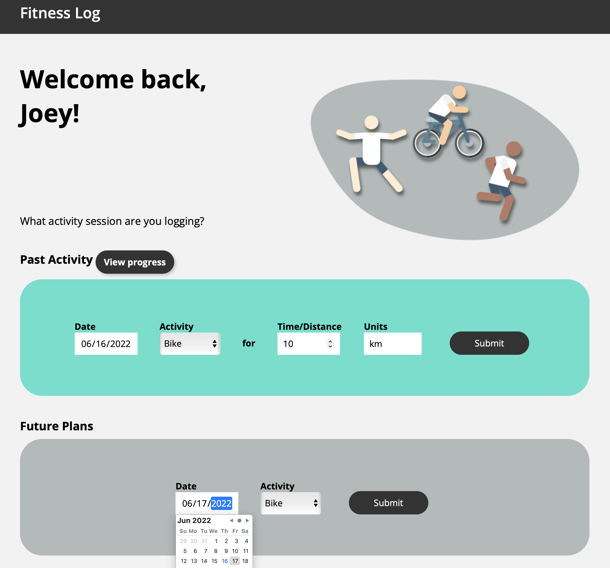
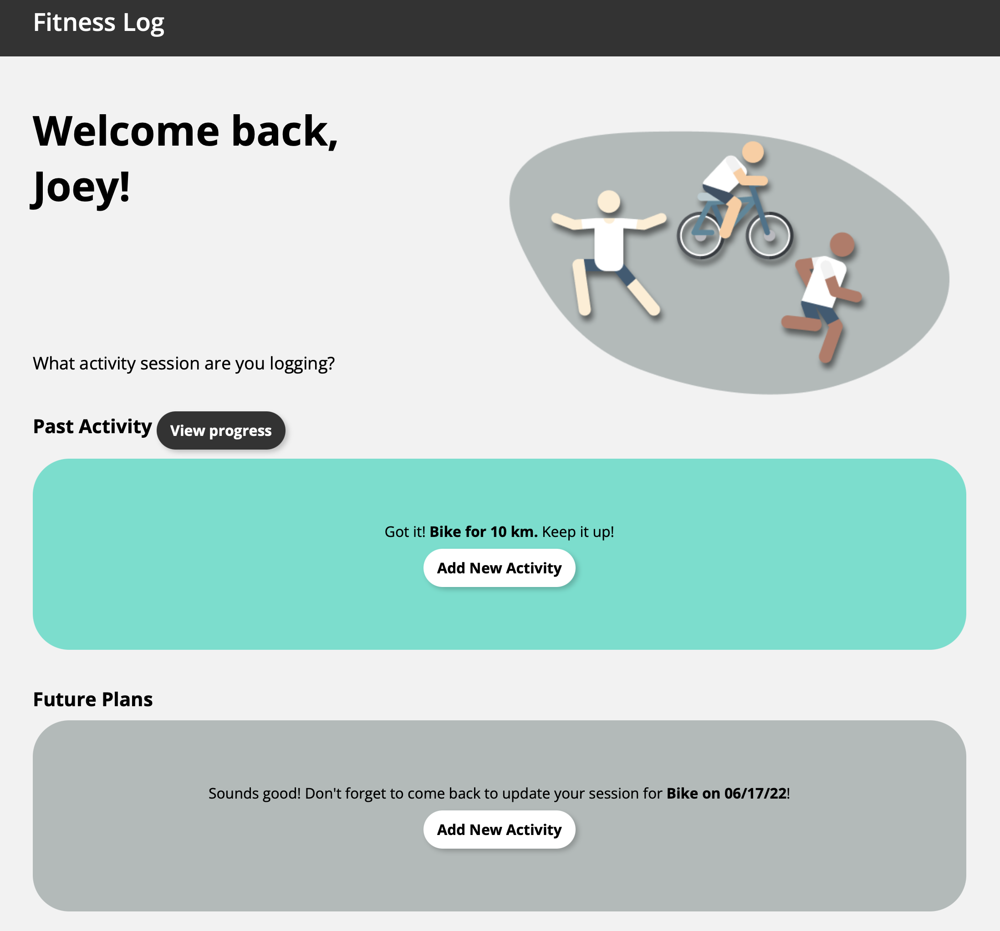
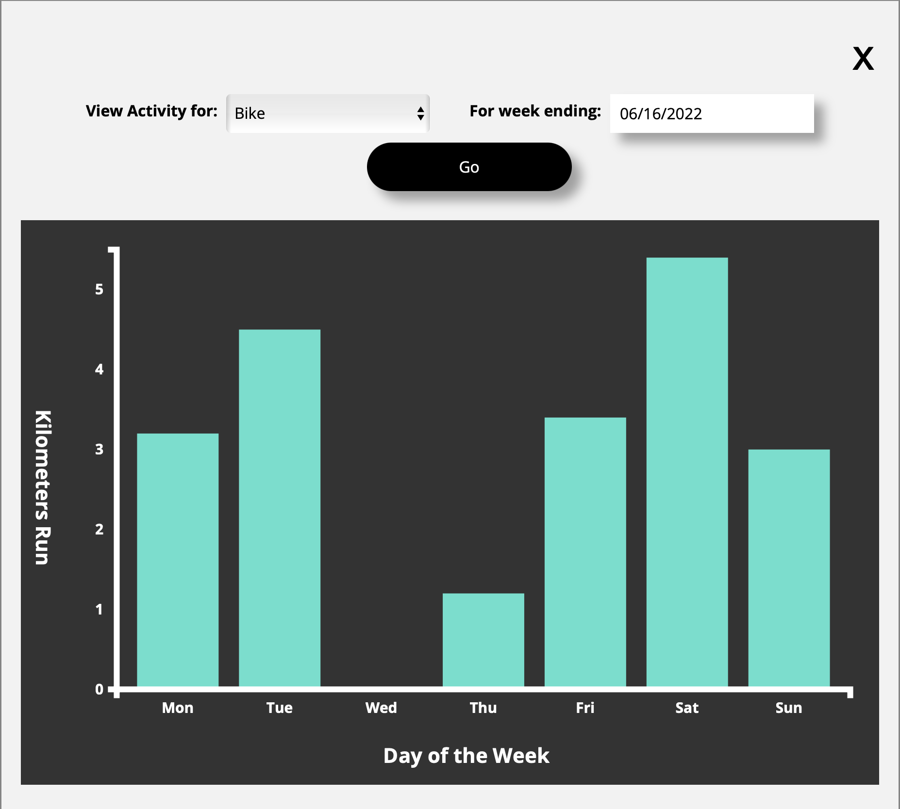

# Fitness-App
This project was done in Spring 2021 for my web programming (ECS162) course at University of California Davis. This project was done in a small group and I was responsible for the front-end of the project (HTML and CSS).

  

  

 Vbr>

